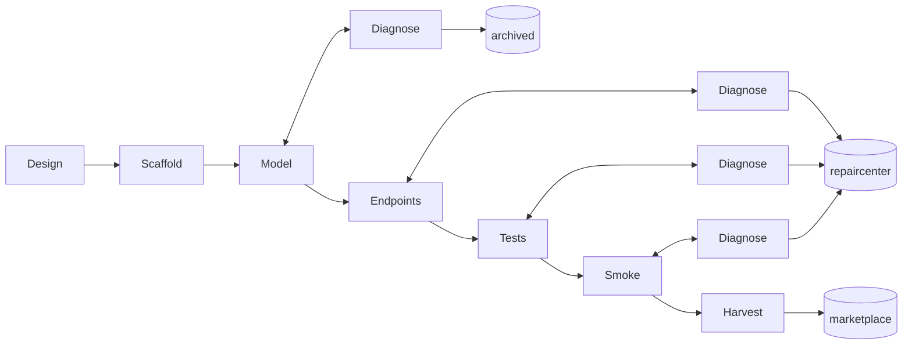

# Factory build plan

Factory reads one spec (`customer/specs/<name>/`) and builds one Jac repo. Reference: `docs/PIPELINE.md`; reasoning: `docs/DECISIONS.md`.

## Graph

## Working dir → bucket

`factory/.work/<name>/` is Factory's working dir for one run:

1. Scaffold runs `jac create <name> --kind service` inside `.work/`, producing `.work/<name>/{jac.toml, main.jac, AGENTS.md, ...}`.
2. Design writes `pipeline.md`, `requirement.md`, `README.md` into `.work/<name>/` (overwriting the scaffold's README stub).
3. Model/Endpoints/Tests/Smoke all work inside `.work/<name>/`. Trajectory is appended to `.work/<name>/.factory/trajectory.jsonl` after every gate run.
4. Harvest (or a Diagnose cap-out) writes `.factory/meta.json` then moves the whole tree into `factory/output/<bucket>/<name>/`.

## Build order

1. ✅ Prerequisite fixes (`CLAUDE.md` doc bug, path conventions).
2. ✅ Scaffold `factory/`, export skills (`jac guide --export`).
3. Shared helpers: gate runner, `claude -p` wrapper, prompt composer. Smoke-test the wrapper alone before wiring any phase.
4. Design + Scaffold, verify against a real spec.
5. Model + `DiagnoseModel`, verify against a real spec — force one failure to see a repair round happen.
6. Endpoints, Tests, Smoke (each with its Diagnose), then Harvest — one at a time, verified before the next.
7. End-to-end: one full spec → `marketplace/`; then a hard spec → `repaircenter`/`archived`.
