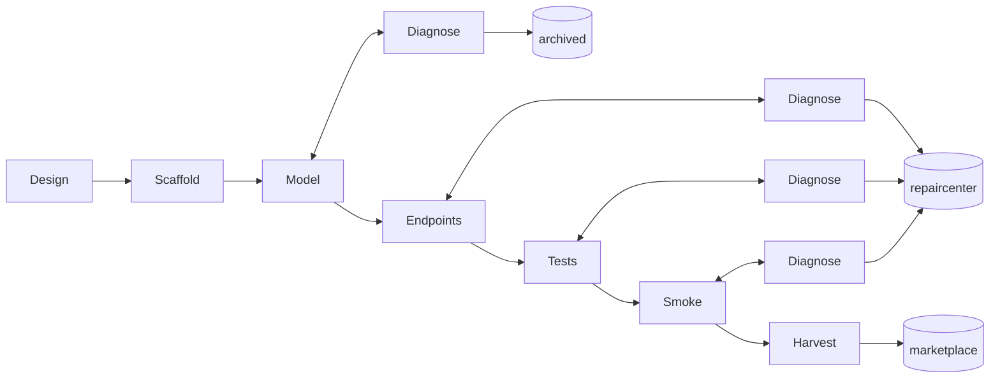

# Factory build plan

Factory reads one spec (`customer/specs/<name>/`) and builds one Jac repo. Reference: `docs/PIPELINE.md`; reasoning: `docs/DECISIONS.md`.

## Graph

## Working dir → bucket

`factory/.work/<name>/` is Factory's working dir for one run:

1. Scaffold runs `jac create <name> --kind service` inside `.work/`, producing `.work/<name>/{jac.toml, main.jac, AGENTS.md, ...}`.
2. Design writes `pipeline.md`, `requirement.md`, `README.md` into `.work/<name>/` (overwriting the scaffold's README stub).
3. Model/Endpoints/Tests/Smoke all work inside `.work/<name>/`. Trajectory is appended to `.work/<name>/.factory/trajectory.jsonl` after every gate run.
4. Harvest (or a Diagnose cap-out) writes `.factory/meta.json` then moves the whole tree into `factory/output/<bucket>/<name>/`.

## Build order

1. ✅ Prerequisite fixes (`CLAUDE.md` doc bug, path conventions).
2. ✅ Scaffold `factory/`, export skills (`jac guide --export`).
3. ✅ Shared helpers: gate runner, `claude -p` wrapper, prompt composer.
4. ✅ Design + Scaffold.
5. ✅ Model + `DiagnoseModel` (incl. plan-drift check).
6. ✅ Endpoints, Tests, Smoke (each with Diagnose), Harvest — all wired.
7. 🟡 End-to-end runs. Gemma-4-12B run completed → routed to `repaircenter/Gemma_freelance-time-tracker` (smoke cap). Ornith-1.5-9B run **all 6 gates PASS on first attempt** (scaffold/design/model/endpoints/tests/smoke) but crashed at Harvest with `08006 connection lost mid-transaction` — the `wipe_jac_pg()` call inside `smoke_gate` wiped the shared pg cluster and killed Factory's own walker-state connection. Failed work preserved at `factory/.work/freelance-time-tracker.ornith-crashed/`. Both bugs from this run fixed below; ready to rerun.

## Open work (pick up here next session)

### Known bugs / weak spots

- **Smoke false negatives from pg persistence** — ✅ Fixed twice. First fix (`wipe_jac_pg()` before each `smoke_gate`) cleared the leftover-data problem but wiped Factory's OWN walker-state db too — same shared cluster (`~/.cache/jac/pg/main`), different databases within it — and crashed the Ornith run at Harvest with `08006`. Second fix: `wipe_project_db(work_dir)` drops ONLY the sub-project's database (`jac_main_<sha1(abspath(work_dir))[:8]>`) via `psql WITH (FORCE)`, leaves the cluster and Factory's own db alone. Ready to rerun.
- **Tests phase model chases `jac test .` discovery** — ✅ Fixed. Ornith wrote correct tests, ran `jac test tests.jac` → 5/5 PASS, then decided to "verify" `jac test .`, got 0 items collected, and spent 30+ min reading Jac's `pytest_plugin.py` and doing background-task polling to fix that phantom. Fix: `tests_task_first` prompt now explicitly says Factory's gate is `jac test <filename>` (explicit), tells the model NOT to try `jac test .` or investigate pytest discovery, and to stop as soon as `jac test <filename>` passes. Same guard added to `tests_repair_task`.
- **Tests phase preload is oversized for the actual task** — ✅ Fixed. `TESTS_SKILLS` no longer preloads `jac-testing`; the ~5 lines of syntax the model actually uses (`test "..." { ... }` block, `root spawn`, `.reports`, `assert`) are inlined into `tests_task_first`. `jac-testing` stays in the on-demand menu for parametrize/MockLLM/JacTestClient edge cases. Hypothesis (from Ornith trace): preloading the harness-internals skill was legitimizing "understand the test runner" as a task and helping open the `jac test .` rabbit hole.
- **Test file discovery** — ✅ Fixed. Any `*test*.jac` at repo root is passed explicitly to `jac test`.
- **Tests repair prompt bias** — ✅ Fixed. Dropped "prefer fixing the test" language; added heuristics (`len(X)==N got 0 → endpoint bug`).
- **Endpoints context overflow on Gemma-4-12B** — happens on long claude-p sessions (was 342s → 88K tokens → compact failed). Larger context window (`-c 131072`+) on llama-server side needed; smaller local models with big context (Ornith `-c 167680`) may avoid it entirely.
- **Model routing bias for Tests failures** — even with the prompt fix, if a walker-endpoint's edge attachment is missing, the model still can't always reason back from `AssertionError: len(entries) == 1` to "start_timer isn't attaching entries via edge." Consider: (a) two-stage repair (resume Endpoints session with test failure as new evidence), (b) tag failure pattern in repair prompt with the specific likely cause.

### Model comparison run (tomorrow)

Repeat the same spec across models, compare per-phase LLM time + trace + final bucket:

- ✅ **Gemma-4-12B-QAT** → `repaircenter/Gemma_freelance-time-tracker/.factory/trajectory.jsonl` (smoke cap, model chased phantom bug for 793s because pg state was leaking — that leak is now fixed, so retry might land in `marketplace`).
- 🟡 **Ornith-1.5-9B** → first run went 6-for-6 on gates but crashed at Harvest (see pg-persistence fix above). Per-phase LLM times captured: design=292s, model=18s, endpoints=246s, tests=**2265s** (tests bloated by the `jac test .` phantom, now guarded against). Rerun once fixes are in; expect Tests to drop to sub-500s with the guard.
- ⏳ (Optional) **Qwen3-30B-A3B-Coder** on colleague's box — expected biggest first-attempt pass-rate jump.

Trace fields in `trajectory.jsonl` per phase: `trace.assistant_ms` (model thinking/generating), `trace.counts[Bash(jac_check)]` (self-iteration count), etc. Use these to compare where each model spends its budget.

### Training-data enrichment (design-only, not yet implemented)

- **Commit-per-gate to expose the dev process as training data.** Factory already `git init`s each `.work/<name>/` (for sub-agent context isolation). Adding one commit right after `persist_trajectory` in every gated phase would turn the run itself into a git history:
  - Author: `factory <factory@local>` (already configured).
  - Subject: `<phase> attempt N: pass|fail`.
  - Body: head-truncated diagnostic (mirrors the repair prompt's `gate.output[:8000]`), then a trailer `Factory-Trailer: {"phase": ..., "attempt": ..., "outcome": ..., "session_id": ..., "gate": ...}` for programmatic extraction.
  - Result: every repair loop becomes a natural (before, diagnostic, after) triple in the diff, which is exactly the SFT/RL signal PIPELINE.md flags as high-value for teaching self-correction.
  - Boundary is **gate**, not tool call: within-phase Read/Edit sequences stay in the claude session jsonl (below), not in git — otherwise the history explodes and net diffs get lost.
  - Concrete hook: a single `commit_gate(work_dir, phase, attempt, outcome, gate_output, session_id)` helper, called from each `on_<phase>` right after `persist_trajectory`. Diagnostic goes to git via `-F <tmpfile>` to avoid shell-escaping headaches with jac check's `✖ Error:` output.

- **Session-level transcripts for turn-level training.** Claude Code writes each `--session-id <uuid>` transcript to `~/.claude/projects/<sanitized-cwd>/<uuid>.jsonl`, where `<sanitized-cwd>` is the sub-agent's cwd with `/` replaced by `-`. Factory already owns the session ids (they live on the walker as `<phase>_session_id` fields) and the cwd (`.work/<name>/`), so the path is deterministic — nothing to search for. To make each sample self-describing, add `session_id` (and derived `session_log_path`) to every trajectory record, and copy the jsonl files themselves into `.factory/sessions/` at Harvest time so the sample is portable (paths under `~/.claude/` won't survive being moved to another machine). Pairs naturally with the commit-per-gate idea: git gives net diffs, session jsonls give the intermediate reasoning; the trajectory joins them by session id.

### Sub-stage improvements to consider

- **Smart-Design ablation** — try Sonnet/Haiku just for Design (planning), keep Model/Endpoints/Tests local. Design is <5% of tokens per project so cost is trivial; hypothesis is that a better plan cuts local-model confusion in downstream phases without teacher-tainting the actual `.jac` code samples. Tag such samples as "design-teacher/code-local".
- **Two-stage tests repair** — when Tests fails with a data-shape error, resume the Endpoints session with the test failure as new evidence before invoking DiagnoseTests. Crosses phase boundaries → FSM change; only pursue if the current heuristic prompt doesn't move the needle.

### Customer follow-ups

- Regenerate `freelance-time-tracker/smoke.yaml` via Customer to verify the new `capture:`/`${var}` schema is emitted correctly by the small model (I hand-patched it to unblock Smoke; Customer prompt was updated but not yet re-run).
- Consider expanding personas beyond current 11 seeds if we want more diverse specs.
