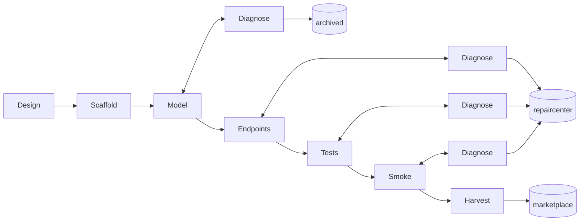

# Factory build plan

Factory reads one spec (`customer/specs/<name>/`) and builds one Jac repo from it, driving headless Claude Code through a gated pipeline. This file is the build checklist. Full technical reference (per-node inputs/outputs, skills, prompt shape) lives in `docs/PIPELINE.md`; reasoning behind each call lives in `docs/DECISIONS.md`.

## Graph

Model/Endpoints/Tests/Smoke each get their **own** Diagnose node — fail loops back to the same stage, pass moves forward. No shared "Fix" node. `archived`/`repaircenter` are just shared terminal boxes, not decision nodes: which one a `Diagnose` node points to is fixed by which node it is (only `DiagModel` can cap with nothing having passed yet, so only it points to `archived`) — nothing decided at runtime. Full version with gates/skills: `docs/PIPELINE.md`.

## Key decisions this round

- **New `Design` phase**, before Scaffold: drafts `pipeline.md` (a mermaid plan) + a jac-annotated `requirement.md` into the build dir. Every later phase reads the annotated copy, not Customer's original spec.
- **Per-stage Diagnose nodes**, not a shared Fix node — removes the "which phase do I resume into" ambiguity entirely.
- **`claude -p --dangerously-skip-permissions`** — safe because each phase runs inside a throwaway scaffolded repo that gets verified by gates regardless.
- **Gates decide advancement, never the model.** `claude -p` exiting only means "the agent stopped"; Factory always re-runs the gate command itself and reads its exit code.
- Prerequisite fix, already applied: `CLAUDE.md`'s `--use <template>` corrected to `--kind service`.
- Each stage owns its own artifacts, no shared top-level dirs — `customer/specs/`, `factory/output/` (the latter already scaffolded).
- **The model defaults to thinking mode on**, which burns tokens on a hidden reasoning trace before the real answer — confirmed this was the entire cause of Customer's earlier multi-minute delays (fixed there with `enable_thinking=False` per `by llm(...)` call, ~20x speedup). `claude -p` talks to the same server over the Anthropic-compatible endpoint, not the OpenAI one Customer uses — need to confirm the equivalent way to disable it there before building `claude_headless`, or every Factory phase will be slow the same way.

## File flow

`factory/output/.build/<name>/` is Factory's working directory for one run:
1. Design writes its 3 files there.
2. Scaffold creates `repo/` inside it (`jac create`), copies those 3 files in.
3. Model/Endpoints/Tests/Smoke all work inside `repo/`.
4. Harvest moves the whole thing into `factory/output/<bucket>/<name>/`.

## Build order

1. ~~Fix prerequisite bugs~~ — done.
2. Scaffold `factory/` as a real Jac project (`jac.toml`, `main.jac`, `AGENTS.md` — `output/` already exists), export skills (`jac guide --export`).
3. Build the shared helpers (gate runner, `claude -p` wrapper, prompt composer) — confirm how to disable thinking mode over the Anthropic-compatible endpoint first; smoke-test the `claude -p` wrapper alone before wiring any phase into it.
4. Build Design + Scaffold, verify against a real spec.
5. Build Model + its Diagnose node, verify against a real spec — force one failure to see a repair round actually happen.
6. Build Endpoints, Tests, Smoke (each with its Diagnose node), then Harvest — one at a time, verified before the next.
7. Full end-to-end run to confirm `marketplace/`; then a deliberately-hard spec to confirm `repaircenter`/`archived` routing.
