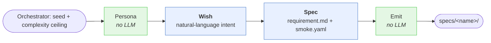

# Customer

Customer produces requirement specs into `specs/`, which Factory consumes. Ordered by a persona's imagined use case, not by enumerated app categories — diversity emerges from personas, not from a topic list.

## Pipeline

Three walker nodes in sequence, plus deterministic bookends.



- **Persona** — pick a seed from `customer/personas/seeds.json`. Orchestrator supplies a complexity ceiling.
- **Wish** — draft `wish.md`: a first-person, natural-language description of the app this persona wants. No schema, just intent. Small, easy LLM task.
- **Spec** — read the wish and produce structured `requirement.md` + `smoke.yaml`. Name the project.
- **Emit** — write to `specs/<name>/`, resolve name collisions, record `meta.json`.

Splitting Wish from Spec keeps each LLM call small enough for the local model, and the wish artifact is itself training-valuable (natural request → structured spec is a useful pair).

## Output

```
specs/<name>/
├── wish.md
├── requirement.md
├── smoke.yaml
└── meta.json
```

`<name>` is a semantic slug the Spec walker generates from the wish (e.g. `grad-student-paper-library`, `home-garden-tracker`). If it collides with an existing entry, orchestrator appends `-2`, `-3`, …

`meta.json` records: persona seed id, complexity ceiling and actual chosen complexity, `uses_byllm` value, model id, timestamps.

## Spec schema (`requirement.md`)

Front matter (YAML):

- `name`, `description` (one line), `persona` (seed id), `complexity` (tiny/small/medium), `uses_byllm` (bool), `non_goals` (list).

Body (Markdown):

- **Data model** — entities with typed fields, relationships with direction and cardinality, invariants. Framework-agnostic vocabulary — describe what the data *is*, not how Jac (or anything else) stores it.
- **Endpoints** — one block per endpoint: **name** (verb-based capability, e.g. `create_paper`, `search_by_tag`), purpose (one line), inputs (typed), output (shape), behavior (one paragraph — not step-by-step), acceptance criteria in prose. No HTTP method, no URL path, no walker/function distinction — those are Factory's choices.
- **Test scenarios** — a short list of end-to-end flows the smoke test will run.

Field types are natural-language nouns from a fixed vocabulary — never programming-language types like `str`, `int`, or `UUID`. Factory translates the nouns into Jac primitives.

| Spec noun | Meaning | Factory translates to |
|---|---|---|
| `string` | text | `str` |
| `integer` | whole number | `int` |
| `number` | numeric (int or float) | `float` |
| `boolean` | true/false | `bool` |
| `timestamp` | date + time | `datetime` |
| `date` | date only | `date` |
| `list of <noun>` | collection | `list[T]` |
| `object` | nested structure | `obj` |
| `id` | identifier | Jac's `jid` (auto-generated) |

## Smoke schema (`smoke.yaml`)

Framework-agnostic assertions the smoke runner interprets. Each step names an endpoint (matching one from `requirement.md`), supplies an input payload, and lists what to check about the response.

```yaml
scenarios:
  - name: create-then-list
    steps:
      - endpoint: create_paper
        input: { title: "CRISPR study", tags: ["bio"] }
        expect_success: true
        expect_output_contains: { title: "CRISPR study" }

      - endpoint: list_papers
        input: {}
        expect_success: true
        expect_output_length: 1
```

Assertion vocabulary (fixed, small, all optional — combine any):

| Assertion | Meaning |
|---|---|
| `expect_success: true` | HTTP 2xx and no error field in the response |
| `expect_error: true` | HTTP 4xx/5xx or an error field in the response |
| `expect_output: <value>` | The response's main payload equals this exactly |
| `expect_output_contains: {k: v, …}` | The main payload has these fields with these values |
| `expect_output_length: N` | The main payload is a list of length N |

Factory's smoke runner does two mechanical translations at test time:

1. `endpoint: <name>` → the actual URL, based on how Factory built that endpoint (walker → `POST /walker/<name>`, function → `POST /function/<name>`).
2. `expect_output_*` → the corresponding field access on the response envelope (walkers report to `reports[…]`, functions return to `returns`).

The Spec walker drafts both `requirement.md` and `smoke.yaml` in the same pass so they stay consistent — same endpoint names, same input/output shapes.

## Complexity ceilings

Passed to Customer as an upper bound — `small` means the walker may produce tiny or small; `medium` means tiny, small, or medium. Not a fixed target. Lets us steer curriculum without forcing a distribution and lets the wish breathe.

- **tiny**: 1–2 nodes, 2–3 endpoints
- **small**: 3–4 nodes, 4–6 endpoints
- **medium**: 5–7 nodes, 8–12 endpoints

## `uses_byllm`

Spec walker sets this from the wish. Persona-dependent, no target ratio — grad student wanting a paper survey naturally implies yes; gardener tracking plants naturally implies no. When true, Factory preloads `jac-by-llm` in the walkers phase; when false, it doesn't.

## Personas

Hand-curated seeds at `customer/personas/seeds.json`. Bootstrap with 5, expand manually only. Automated persona generation trends toward the same LLM personality across entries — a diversity failure mode we specifically avoid.

## Templates

Deferred for v1. Customer works from this doc's schema alone. If output proves inconsistent, hand-curated examples get added under `customer/templates/<complexity>/<name>/` — signal-driven, not upfront.

## Bootstrap plan

1. This doc + `customer/personas/seeds.md` (5 seeds).
2. Build the Customer walker skeleton (Persona → Wish → Spec → Emit).
3. Run against the 5 seeds → 5 wishes → 5 specs.
4. Review together, iterate on prompts / schema / add templates only where the local model actually needs help.
