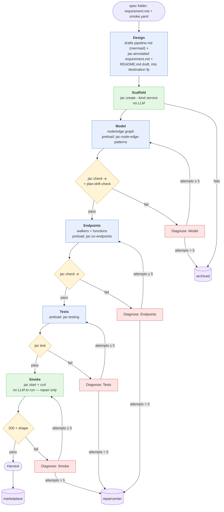

# Pipeline

Scope and top-level decisions live in [`BACKGROUND.md`](BACKGROUND.md); this doc describes the shape. Load-bearing choices and their why live in [`DECISIONS.md`](DECISIONS.md).

Two stages, each a Jac walker on its own OSP graph:

- **`customer/`** — drafts specs into `customer/specs/<name>/`.
- **`factory/`** — reads one spec, produces one candidate repo.

A third **Repair** pipeline exists too — takes `repaircenter/` samples, drives a different model with its own budget, and promotes to `refurbished/` or pushes to `archived/`. Own doc when we design it.

## Input and output

- **In:** `customer/specs/<name>/{requirement.md, smoke.yaml}` (Customer's output — never mutated).
- **Working dir:** `factory/.work/<name>/` (outside `output/`, hidden, temporary — moved into a bucket at end of run).
- **Out:** `factory/output/{marketplace,repaircenter,archived}/<name>/`. The directory *is* the runnable Jac project — `main.jac`, `jac.toml`, `README.md`, `pipeline.md`, etc. sit at the top so `cd`ing in feels like a normal repo. Metadata (`trajectory.jsonl`, `meta.json`) lives in a hidden `.factory/` subdir. Customer's original spec is **not** copied — the shared `<name>` is the link back to `customer/specs/<name>/`, which lets a project's journey stay traceable across buckets without content duplication.

## The build graph

One walker per run, all state on the walker (see [`ANTIPATTERNS.md`](ANTIPATTERNS.md)). N parallel builds = N walkers on the same graph.



Blue = LLM phase, green = deterministic, yellow = gate, red = diagnose-and-retry, purple = terminal bucket.

Each gated phase owns its own gate node — currently two `jac check` nodes, one `jac test`, one HTTP-shape check. They stay as separate nodes on purpose: a v2 phase can bring its own gate command without touching a shared dispatch, and each phase's fail edge points at exactly one Diagnose node.

### Design: framework-agnostic spec → detailed Jac plan

Customer's spec has no Jac vocabulary. Design is where walker-vs-function, node/edge naming, field types, defaults, and per-endpoint flow all get decided — explicitly, before any code is written. Model and Endpoints then transcribe from Design's plan rather than making design decisions themselves.

- **Reads:** the spec folder (Customer's `requirement.md` + `smoke.yaml`).
- **Writes into the destination fp:**
  - `pipeline.md` — the detailed plan, with fixed sections:
    - `## Overview` — one-line mermaid + short prose on data flow.
    - `## Data model` — one `### node <Name>` / `### edge <Name>: <From> --> <To>` block per entity, with typed `has` field lists and defaults.
    - `## Endpoints` — one block per capability: `walker:pub` / `def:pub`, inputs, output, numbered `flow:` steps in Jac terms, and `touches:` (which node/edge types it reads or writes).
    - `## Traversal notes` — any tricky patterns worth calling out.
  - `requirement.md` — jac-annotated copy of Customer's spec (adds `Jac form: walker|function` per endpoint block; keeps framework-agnostic vocabulary otherwise).
  - `README.md` — human-readable project description (replaces the scaffold's stub).
- **Gate:** deterministic — pipeline.md has a fenced ` ```mermaid ` block plus `## Data model` and `## Endpoints` sections; all 3 files exist. On fail, the failure is fed to `DiagnoseModel`'s first repair round as extra context; there's no dedicated diagnose node for Design since there's no code to check yet.

Every later phase reads Design's `requirement.md`, never Customer's original.

## Nodes at a glance

| Node | LLM? | Input | Output | Gate |
|---|---|---|---|---|
| Design | yes | spec folder | `pipeline.md`, jac-annotated `requirement.md`, `README.md` draft (destination fp) | valid mermaid + every capability has a Jac form |
| Scaffold | no | destination fp | `jac create --kind service` tree at destination fp | `jac.toml` exists |
| Model | yes | scaffolded repo + `pipeline.md` (Data model section) | `model.jac` at repo root — `node`/`edge` declarations transcribed from plan | `jac check -e .` + [plan-drift check](#model-plan-drift-check) |
| Diagnose: Model | yes | failing gate output + resumed session | repaired repo | — |
| Endpoints | yes | repo (with model.jac) + `pipeline.md` (Endpoints section) | walkers/functions in `main.jac` (or `endpoints.jac`) transcribed from plan | `jac check -e .` |
| Diagnose: Endpoints | yes | failing `jac check` output | repaired repo | — |
| Tests | yes | repo + `requirement.md` (test scenarios) | test file(s) in repo | `jac test` |
| Diagnose: Tests | yes | failing `jac test` output | repaired repo | — |
| Smoke | no | running repo + `smoke.yaml` | pass/fail per assertion | HTTP response shape |
| Diagnose: Smoke | yes | failing assertions | repaired repo | — |
| Harvest | no | scaffolded repo + trajectory | `factory/output/<bucket>/<name>/` — the whole Jac project at top level, with `.factory/{trajectory.jsonl, meta.json}` alongside | — |

## Diagnose-loop rules

- Per-gate counter lives on the walker; resets to 0 when a phase is entered.
- Fresh `claude -p --session-id <id>` on the first attempt; `--resume <id>` on every retry so the model remembers prior attempts. New phase = new session.
- **Cap per gate: 5. Global cap per run: 20.** Exceeding either → Diagnose writes to its bucket (`DiagnoseModel` → archived, all others → repaircenter) and disengages.
- Phase-to-Diagnose visits use a type-filtered edge (e.g. `visit [here -->[?:DiagnoseModelNode]];`) since phase nodes have two outgoing edges — forward-on-pass, diagnose-on-fail.
- **Gate command must include `-e`** for `jac check`. Plain `jac check` prints "X failed" but exits 0 — see [`ANTIPATTERNS.md`](ANTIPATTERNS.md). `jac test` already exits non-zero correctly.
- **Diagnostics passed to repair are head-truncated to 8000 chars** (`gate.output[:8000]`), not tail-truncated. jac check lists first errors first (usually root cause); later errors often cascade.

### Model plan-drift check

After `jac check -e` passes for Model, an extra deterministic check runs: parse pipeline.md's `## Data model` for declared node/edge names, parse `.jac` files at the repo root for the same, diff. Anything declared in code but not in the plan (minus known scaffold types like `Message`) counts as **drift** and is fed back to `DiagnoseModel` as a failure, same as a `jac check` fail. Catches the small-model failure mode of inventing tutorial-familiar types (`Person`/`Repository`/etc) that weren't in the plan.

## Trajectory

Every gate run appends one record to the walker's `trajectory`, persisted incrementally to `.work/<name>/.factory/trajectory.jsonl` (so if a run crashes mid-pipeline, the partial trajectory survives). Harvest / cap-out just moves the file into the bucket along with the rest of the tree.

```
{
  "phase": "endpoints",
  "attempt": 2,
  "outcome": "pass" | "fail" | "capped",
  "gate": "jac check",
  "llm_ms": 78000,
  "gate_ms": 350,
  "duration_ms": 78350,
  "diagnostics": "..."
}
```

Two uses: analytics (which phase fails most, which diagnostic codes dominate) and training signal ((state, diagnostic, fix) triples for teaching self-correction).

## Skill injection

`factory/skills/` is populated once via `jac guide --export ./skills/`; the CLI is the source of truth. Sub-agents run inside `.work/<name>/`, so skills live at `../../skills/<name>/SKILL.md` relative to their cwd. Each phase's prompt has five parts:

1. **Stable prefix** — system prompt + `jac-core-cheatsheet` + `jac-project-kinds`. Byte-identical across every phase and every attempt within a phase.
2. **Skills menu** — one-line-per-skill list of everything in `./skills/` *except* what's already preloaded, so the model can decide what to read on demand. Descriptions are first-sentence only.
3. **Preloaded phase skill** — exactly one per phase (Model: `jac-node-edge-patterns`, Endpoints: `jac-sv-endpoints`, Tests: `jac-testing`). Kept intentionally small: the model can Read others on demand via the menu.
4. **Phase task** — from walker state; on repair, includes the failing gate's head-truncated output.
5. **On-demand** — anything else in the menu, read mid-phase via the model's file tool. Verified working end-to-end: probing a sub-agent with an unfamiliar skill and a task requiring it, the sub-agent Reads the file and uses its content.

Parts 1–3 are what `llama-server`'s KV-cache reuses across calls; part 5 happens after that boundary and doesn't invalidate the cache.

## Headless agent invocation

Factory invokes claude with:
```
claude -p <prompt>
  --bare                                          # skip auto-memory, CLAUDE.md discovery, plugin sync, hooks, keychain
  --dangerously-skip-permissions                  # no approval prompts — safe: throwaway repo, gated afterward
  --exclude-dynamic-system-prompt-sections        # move cwd/env/git-status out of system prompt, keeps cache stable
  --output-format text
  --session-id <uuid>   (first attempt) | --resume <uuid> (repair rounds)
```

`--bare` also switches auth to strictly `ANTHROPIC_API_KEY` (not `_AUTH_TOKEN`). Unsloth's env sets `_AUTH_TOKEN`, so `capture_claude_env` aliases it to `_API_KEY` too.

Sub-agents run inside `.work/<name>/` where Scaffold ran `git init` — that isolates the git context (fresh empty repo, no leak of parent JacProjectFactory commits or user identity into the sub-agent's auto-loaded environment). Claude's harness still auto-detects git and injects a status block, but the block now shows nothing.

**Gates decide advancement, never the model.** `claude -p` exiting just means the agent stopped taking turns. Factory always re-runs the phase's gate command itself and reads its exit code. On non-zero exit from claude -p, Factory logs `stderr` for debugging.

## Output buckets

Every bucket entry is the runnable Jac project directly at `<name>/`, with `.factory/{trajectory.jsonl, meta.json}` alongside. Customer's spec is *not* copied — the shared `<name>` links back to `customer/specs/<name>/`.

- **`marketplace/`** — clean SFT data.
- **`repaircenter/`** — passed ≥1 gate then capped; awaiting Repair (RL "almost got it" signal in the meantime).
- **`refurbished/`** — a Repair pass got everything green. Tagged in `meta.json` so it stays distinguishable from marketplace originals.
- **`archived/`** — terminal, never retried.

Factory writes `marketplace/`/`repaircenter/`/`archived/` only; Repair writes `refurbished/`/`archived/`. Cross-bucket moves happen only through a deliberate Repair action.

## Model server

Unsloth Studio, persistent, `localhost:8888`. OpenAI + Anthropic compatible; token in `Authorization: Bearer $UNSLOTH_STUDIO_AUTH_TOKEN`. Concurrent requests fine; no restart between callers.

- **`claude -p`:** Factory captures env from `unsloth start claude --no-launch` at startup (`ANTHROPIC_BASE_URL`, `ANTHROPIC_AUTH_TOKEN`, `ANTHROPIC_MODEL`, a few `CLAUDE_CODE_*` tuning vars) and reuses it for every subsequent subprocess call.
- **byllm (Customer):** points at `http://localhost:8888/v1` with the same token.
- **Ad-hoc HTTP:** same endpoint.

## v1 guardrails

- **No JSX, no npm imports, no React.** `--kind service` has no client target; slippage fails `jac check`, and Diagnose reads `jac-codespaces` on-demand to rewrite as pure Jac.
- **Prefer pure Jac over Python interop.** Reach for `jac-python-interop` only when Jac stdlib genuinely can't do it. Uniformity matters for training data.
