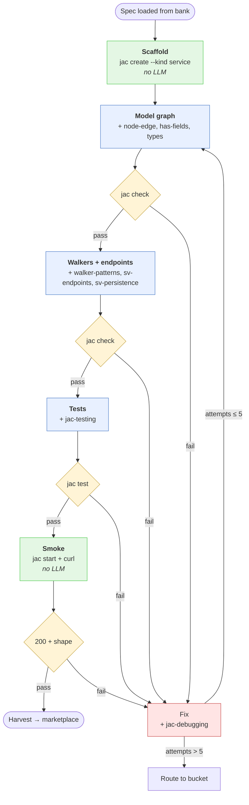

# Pipeline

The v1 build pipeline generates backend-only Jac projects. Scope, motivation, and the top-level decisions live in [`BACKGROUND.md`](BACKGROUND.md); this doc describes the shape.

The pipeline runs in two stages, both implemented in Jac using OSP:

- **`customer/`** — a walker that drafts requirement specs and writes them into a versioned `specs/` bank. (The "Customer" places an order at the factory.)
- **`factory/`** — a walker that reads one spec and produces one candidate repo.

They stay separate because specs and builds have different models, different cache lifetimes, and different failure modes. A bad spec is unrecoverable; a bad build is retryable. Regenerating the spec bank must not touch the build pipeline.

Repair is a **third**, independent pipeline. It takes a `repaircenter/` sample and drives a different model with a different budget to promote it to `refurbished/` or push it to `archived/`. It does not share Factory's FSM — its shape will live in `REPAIR.md` when we design it.

## The build graph

The orchestrator is a Jac graph. One project generation is one walker traversing it, carrying the run's state (spec id, session id, per-gate counter, global counter, trajectory). Running N repos in parallel is N walkers on the same graph.



Blue = LLM phase, green = deterministic, yellow = gate, red = fix.

The **Fix** node is one shared node, not four copies. It reads the failing phase, the gate command, and prior attempts from the walker's state and drives one repair round, then hands control back to the failing phase. Same principle for the gate check itself — one shared implementation parameterized by which shell command to run.

The **Smoke** node reads Customer's `smoke.yaml` (framework-agnostic — endpoint names and `expect_*` assertions), maps each `endpoint: <name>` to the URL Factory actually built for it (`/walker/<name>` if Factory made it a walker, `/function/<name>` if a function), and translates each assertion against the response envelope (walker `reports[…]` or function `returns`). See `CUSTOMER.md` for the assertion vocabulary. This mapping is Factory's responsibility, not Customer's — see the "specs are framework-agnostic" decision in `DECISIONS.md`.

## Nodes at a glance

| Node | LLM? | Gate | Phase-specific skills |
|---|---|---|---|
| Scaffold | no | `jac.toml` exists, tree valid | — |
| Model graph | yes | `jac check .` | `jac-node-edge-patterns`, `jac-has-fields`, `jac-types` |
| Walkers + endpoints | yes | `jac check .` | `jac-walker-patterns`, `jac-sv-endpoints`, `jac-sv-persistence` |
| Tests | yes | `jac test` | `jac-testing` |
| Smoke | no | assertions in `smoke.yaml` pass | — |
| Fix (shared) | yes | re-run failing gate | `jac-debugging` + failing phase's skills |

## Fix-loop rules

- **Per-gate counter, starts at 0 when the phase is entered.**
- On gate failure: counter += 1, orchestrator captures the diagnostics as a todo, model repairs, gate re-runs.
- The model's session is resumed within a phase (`claude -p --resume <session-id>`) so it remembers prior attempts. A new phase starts a fresh session.
- **Cap per gate: 5.** Exceeding it routes the sample to a non-marketplace bucket (see below); it is not thrown away.
- **Global cap per run: 20 attempts total.** Catches slow-progress pathological runs that keep barely surviving each gate.
- Advancing to a new gate resets its counter to 0.

## Trajectory

Every phase and every fix attempt emits a `report` on the walker. At end of run the walker's `.reports` are the trajectory — an ordered log of what happened, what failed, and how it was repaired.

Record shape:

```
{
  "phase": "walkers",
  "attempt": 2,
  "outcome": "pass" | "fail" | "capped",
  "gate": "jac check",
  "diagnostics": [...],
  "duration_ms": 12345
}
```

The trajectory is harvested alongside the repo. Two uses:

1. **Analytics** — which phase fails most, which cap gets hit, which diagnostic codes dominate. This is how the pipeline gets tuned.
2. **Training signal** — the (state, diagnostic, fix) triples are useful for teaching self-correction.

## Skill injection

Skills come from `jac guide --export ./skills/` at pipeline-init time. The pipeline does not bundle its own copy — the CLI is the source of truth and stays aligned.

Every LLM phase's prompt has this shape:

1. **Stable prefix** (identical bytes across phases): system prompt (which tells the model where `./skills/` lives and to read from it when unsure of syntax or patterns), `jac-core-cheatsheet`, `jac-project-kinds`, repo tour.
2. **Preloaded phase skills** (from the node table below) — the ones the model *definitely* needs, injected so it doesn't pay a file-read round-trip for them.
3. **Phase task** (composed from the walker's state).
4. **On-demand skills** — everything else in `./skills/`, not injected. The model reads them mid-phase via its file tool if it decides it needs them.

Prefix stability is what makes `llama-server`'s KV cache reuse work across phases; the preload list per phase is fixed, so the prefix through part 2 is byte-stable within a phase. On-demand reads happen after that boundary and don't invalidate the cached prefix.

## Output buckets

Nothing is thrown away. Every run lands in one of four buckets, and every bucket keeps the same shape: `{repo/, spec/ (wish.md + requirement.md + smoke.yaml, copied from Customer's output), trajectory.jsonl, meta.json}`. `meta.json` records which bucket, why, model id, jac version, spec id.

- **`output/marketplace/<name>/`** — passed every gate on the first build. Clean SFT data.
- **`output/repaircenter/<name>/`** — got past scaffold and passed at least one gate before hitting a cap. Awaiting repair. Still useful as RL "almost got it" signal before repair happens.
- **`output/refurbished/<name>/`** — was in `repaircenter/` and a later Repair-pipeline pass got every gate green. Same `<name>` as the repaircenter entry so the project's journey is traceable across buckets. Tagged in `meta.json` as `refurbished` so it stays distinguishable from marketplace-originals in training.
- **`output/archived/<name>/`** — never passed a gate on the first build, **or** was in `repaircenter/` and a Repair attempt gave up. Terminal — we don't retry archived samples. Individually low signal, useful in aggregate for diagnostics-frequency and phase-failure stats.

Factory (the build pipeline) writes only to `marketplace/`, `repaircenter/`, or `archived/`. Repair writes only to `refurbished/` or `archived/`. Nothing routes back into the build automatically; a project moves between buckets only through Repair, which is a deliberate tagged action.

## Model server

One local model, one server, many clients.

Unsloth Studio is run persistently and exposes an OpenAI + Anthropic compatible API on `localhost:8888` (`/v1/chat/completions`, `/v1/messages`, `/v1/responses`, `/v1/models`), authed via `Authorization: Bearer $UNSLOTH_STUDIO_AUTH_TOKEN`. Every client the pipeline uses points at that same server:

- **Coding agent (Claude Code):** launched via `unsloth start claude`, which detects the running Studio and connects to it.
- **byllm calls from Jac orchestrator code:** provider config points at `http://localhost:8888/v1` with the same token.
- **Ad-hoc HTTP:** anything else (analytics, curl, tests) hits the same endpoint.

No session collision, no restart between callers — the server handles concurrent requests. The Studio process is the pipeline's model dependency; when it's up, everything routes.

## v1 guardrails

Constraints the phase system prompt states up front and the gates enforce:

- **No JSX, no npm imports, no React.** `--kind service` has no client target; any JSX/npm import will fail placement at `jac check`. When it does slip through, the Fix loop reaches for `jac-codespaces` on-demand to help the model understand the diagnostic and rewrite as pure Jac.
- **Prefer pure Jac over Python interop.** Python is available via `jac-python-interop` but should be reached for only when Jac stdlib genuinely can't do the thing. Uniformity of output matters for training-data quality.

## What byllm is *not* used for

byllm is not an FSM controller. It does not decide which phase runs next, when a gate has passed, or which bucket a sample lands in. The model reading `./skills/*.md` mid-phase via its file tool is *not* byllm-driven — it's the model using its own file-read tool inside a phase whose control flow is still owned by the FSM. If we ever want deterministic per-run *preload* selection, the hook is a `skills_hint: [...]` field in the spec, decided once by Customer.
