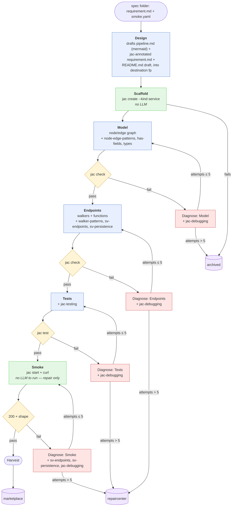

# Pipeline

Scope and top-level decisions live in [`BACKGROUND.md`](BACKGROUND.md); this doc describes the shape. Load-bearing choices and their why live in [`DECISIONS.md`](DECISIONS.md).

Two stages, each a Jac walker on its own OSP graph:

- **`customer/`** — drafts specs into `customer/specs/<name>/`.
- **`factory/`** — reads one spec, produces one candidate repo.

A third **Repair** pipeline exists too — takes `repaircenter/` samples, drives a different model with its own budget, and promotes to `refurbished/` or pushes to `archived/`. Own doc when we design it.

## Input and output

- **In:** `customer/specs/<name>/{requirement.md, smoke.yaml}` (Customer's output — never mutated).
- **Working dir:** `factory/.work/<name>/` (outside `output/`, hidden, temporary — moved into a bucket at end of run).
- **Out:** `factory/output/{marketplace,repaircenter,archived}/<name>/`. The directory *is* the runnable Jac project — `main.jac`, `jac.toml`, `README.md`, `pipeline.md`, etc. sit at the top so `cd`ing in feels like a normal repo. Metadata (`trajectory.jsonl`, `meta.json`) lives in a hidden `.factory/` subdir. Customer's original spec is **not** copied — the shared `<name>` is the link back to `customer/specs/<name>/`, which lets a project's journey stay traceable across buckets without content duplication.

## The build graph

One walker per run, all state on the walker (see [`ANTIPATTERNS.md`](ANTIPATTERNS.md)). N parallel builds = N walkers on the same graph.



Blue = LLM phase, green = deterministic, yellow = gate, red = diagnose-and-retry, purple = terminal bucket.

Each gated phase owns its own gate node — currently two `jac check` nodes, one `jac test`, one HTTP-shape check. They stay as separate nodes on purpose: a v2 phase can bring its own gate command without touching a shared dispatch, and each phase's fail edge points at exactly one Diagnose node.

### Design: framework-agnostic spec → Jac plan

Customer's spec has no Jac vocabulary. Design is where walker-vs-function and node/edge naming get decided, explicitly, before any code is written.

- **Reads:** the spec folder.
- **Writes into destination fp:**
  - `pipeline.md` — mermaid + prose: entities, node/edge shape, each capability's Jac form and why.
  - `requirement.md` — jac-annotated copy of Customer's spec.
  - `README.md` — project description (later shipped in the repo as-is).
- **Gate:** deterministic — a fenced ` ```mermaid ` block exists, and every capability from Customer's original has a Jac form in the annotated copy. On fail, the failure becomes extra context for `DiagnoseModel`'s first attempt; there's no dedicated diagnose node for Design since there's no code to check yet.

Every later phase reads Design's `requirement.md`, never Customer's original.

## Nodes at a glance

| Node | LLM? | Input | Output | Gate |
|---|---|---|---|---|
| Design | yes | spec folder | `pipeline.md`, jac-annotated `requirement.md`, `README.md` draft (destination fp) | valid mermaid + every capability has a Jac form |
| Scaffold | no | destination fp | `jac create --kind service` tree at destination fp | `jac.toml` exists |
| Model | yes | repo + jac-annotated `requirement.md` (data model) | node/edge graph types in repo | `jac check` |
| Diagnose: Model | yes | failing `jac check` output, attempt count | repaired repo (resumed session) | — |
| Endpoints | yes | repo (with model types) + `requirement.md` (endpoints) | walkers/functions in repo | `jac check` |
| Diagnose: Endpoints | yes | failing `jac check` output | repaired repo | — |
| Tests | yes | repo + `requirement.md` (test scenarios) | test file(s) in repo | `jac test` |
| Diagnose: Tests | yes | failing `jac test` output | repaired repo | — |
| Smoke | no | running repo + `smoke.yaml` | pass/fail per assertion | HTTP response shape |
| Diagnose: Smoke | yes | failing assertions | repaired repo | — |
| Harvest | no | scaffolded repo + trajectory | `factory/output/<bucket>/<name>/` — the whole Jac project at top level, with `.factory/{trajectory.jsonl, meta.json}` alongside | — |

## Diagnose-loop rules

- Per-gate counter lives on the walker; resets to 0 when a phase is entered.
- Fresh `claude -p --session-id <id>` on the first attempt; `--resume <id>` on every retry so the model remembers prior attempts. New phase = new session.
- **Cap per gate: 5. Global cap per run: 20.** Exceeding either → Diagnose writes to its bucket (`DiagnoseModel` → archived, all others → repaircenter) and disengages.
- Phase-to-Diagnose visits use a type-filtered edge (e.g. `visit [here --> (`?DiagnoseModel)];`) since phase nodes have two outgoing edges — forward-on-pass, diagnose-on-fail.

## Trajectory

Every gate run appends one record to the walker's `trajectory`, persisted incrementally to `.work/<name>/.factory/trajectory.jsonl` (so if a run crashes mid-pipeline, the partial trajectory survives). Harvest / cap-out just moves the file into the bucket along with the rest of the tree.

```
{
  "phase": "endpoints",
  "attempt": 2,
  "outcome": "pass" | "fail" | "capped",
  "gate": "jac check",
  "llm_ms": 78000,
  "gate_ms": 350,
  "duration_ms": 78350,
  "diagnostics": "..."
}
```

Two uses: analytics (which phase fails most, which diagnostic codes dominate) and training signal ((state, diagnostic, fix) triples for teaching self-correction).

## Skill injection

`factory/skills/` is populated once via `jac guide --export ./skills/`; the CLI is the source of truth. Each phase's prompt has four parts:

1. **Stable prefix** — system prompt + `jac-core-cheatsheet` + `jac-project-kinds` + repo tour. Byte-identical across every phase and every attempt within a phase.
2. **Preloaded phase skills** (per node table). Always includes `jac-debugging` — even on the first attempt — so the byte prefix stays identical when a repair resumes.
3. **Phase task** — from walker state, or on repair the failing gate's output.
4. **On-demand** — everything else in `./skills/<name>/SKILL.md`, read by the model's own file tool mid-phase when it needs it.

Parts 1–2 are what `llama-server`'s KV-cache reuses across calls; part 4 happens after that boundary and doesn't invalidate the cache.

## Headless agent invocation

Factory invokes `claude -p --dangerously-skip-permissions` (safe here — throwaway repo, gated afterward; full rationale in `DECISIONS.md`). It never treats `claude -p` returning as "phase done" — Factory re-runs the gate itself and reads its exit code.

## Output buckets

Every bucket entry is the runnable Jac project directly at `<name>/`, with `.factory/{trajectory.jsonl, meta.json}` alongside. Customer's spec is *not* copied — the shared `<name>` links back to `customer/specs/<name>/`.

- **`marketplace/`** — clean SFT data.
- **`repaircenter/`** — passed ≥1 gate then capped; awaiting Repair (RL "almost got it" signal in the meantime).
- **`refurbished/`** — a Repair pass got everything green. Tagged in `meta.json` so it stays distinguishable from marketplace originals.
- **`archived/`** — terminal, never retried.

Factory writes `marketplace/`/`repaircenter/`/`archived/` only; Repair writes `refurbished/`/`archived/`. Cross-bucket moves happen only through a deliberate Repair action.

## Model server

Unsloth Studio, persistent, `localhost:8888`. OpenAI + Anthropic compatible; token in `Authorization: Bearer $UNSLOTH_STUDIO_AUTH_TOKEN`. Concurrent requests fine; no restart between callers.

- **`claude -p`:** Factory captures env from `unsloth start claude --no-launch` at startup (`ANTHROPIC_BASE_URL`, `ANTHROPIC_AUTH_TOKEN`, `ANTHROPIC_MODEL`, a few `CLAUDE_CODE_*` tuning vars) and reuses it for every subsequent subprocess call.
- **byllm (Customer):** points at `http://localhost:8888/v1` with the same token.
- **Ad-hoc HTTP:** same endpoint.

## v1 guardrails

- **No JSX, no npm imports, no React.** `--kind service` has no client target; slippage fails `jac check`, and Diagnose reads `jac-codespaces` on-demand to rewrite as pure Jac.
- **Prefer pure Jac over Python interop.** Reach for `jac-python-interop` only when Jac stdlib genuinely can't do it. Uniformity matters for training data.
