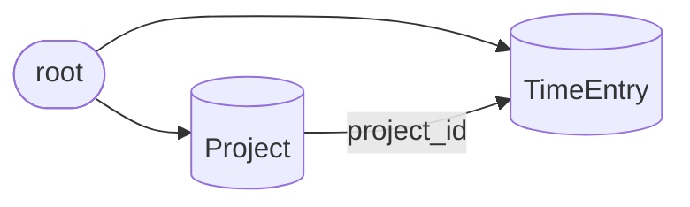

# Freelance Time Tracker

## Overview

This is a headless Jac API service (`kind = "service"`): the graph persists on the
shared guest `root`, and each `def:pub` endpoint is an HTTP route. Projects and time
entries are the only two archetypes. There is no client UI and no typed edge archetype —
`project_id` is a plain reference (a `jid`) to its owning Project.



Projects and time entries are created on `root`; each time entry links back to its
project through the `project_id` reference. Endpoints create these nodes, list them with
a type-narrowed reference read, and update a single node found by `jid`.

## Data model

```jac
import from datetime { datetime };


node Project {
    has name: str;
    has client_name: str = "";
    has status: str = "new";
}


node TimeEntry {
    has project_id: jid | None = None;
    has start_time: datetime | None = None;
    has end_time: datetime | None = None;
    has duration_minutes: int = 0;
    has note: str = "";
    has is_paid: bool = False;
}
```

> The spec's `id` maps to Jac's built-in `jid` — no `id` field is declared; Jac
> auto-generates each node's identifier.

### node Project
- has name: str
- has client_name: str [= ""]
- has status: str [= "new"]

### node TimeEntry
- has project_id: jid | None [= None]
- has start_time: datetime | None [= None]
- has end_time: datetime | None [= None]
- has duration_minutes: int [= 0]
- has note: str [= ""]
- has is_paid: bool [= False]

## Endpoints

### create_project — def:pub
- inputs: name: str, client_name: str
- output: Project (typed node — this is the wire format)
- flow:
    1. Construct the node from the inputs: `Project(name=name, client_name=client_name)`.
    2. Connect to the guest root and return the created node: `return root ++> Project(name=name, client_name=client_name);`
- touches: writes Project (creates a new Project on root).

### list_projects — def:pub
- inputs: none
- output: list[Project]
- flow:
    1. Read every Project reachable from root via a type-narrowed outgoing reference: `return [root -->][?:Project];`
- touches: reads Project (no mutation).

### start_timer — def:pub
- inputs: project_id: jid
- output: TimeEntry (typed node)
- flow:
    1. Construct a TimeEntry with the supplied project and the current instant as start: `TimeEntry(project_id=project_id, start_time=datetime.now())`.
    2. Connect to root and return the created node: `return root ++> TimeEntry(project_id=project_id, start_time=datetime.now());`
- touches: writes TimeEntry (creates a new TimeEntry on root, linked to its Project via project_id).

### stop_timer — def:pub
- inputs: entry_id: jid
- output: TimeEntry | None
- flow:
    1. Find the entry by jid over the outgoing Project-rooted read: `for e in [root -->][?:TimeEntry] { if jid(e) == entry_id { ... } }`.
    2. Stamp the end time: `e.end_time = datetime.now();`.
    3. Derive the duration in minutes and assign it: `e.duration_minutes = round((e.end_time - e.start_time).total_seconds() / 60);`.
    4. Return the updated entry, or `None` when the jid is not found.
- touches: reads then writes TimeEntry (sets end_time and duration_minutes).

### list_time_entries — def:pub
- inputs: project_id: jid
- output: list[TimeEntry]
- flow:
    1. Read all entries from root, filtered to the given project: `return [e for e in [root -->][?:TimeEntry] if e.project_id == project_id];`
- touches: reads TimeEntry (no mutation).

### mark_as_paid — def:pub
- inputs: entry_id: jid
- output: TimeEntry | None
- flow:
    1. Find the entry by jid over the outgoing Project-rooted read: `for e in [root -->][?:TimeEntry] { if jid(e) == entry_id { ... } }`.
    2. Set the flag: `e.is_paid = True;`.
    3. Return the updated entry, or `None` when the jid is not found.
- touches: reads then writes TimeEntry (sets is_paid).

## Traversal notes

- **No endpoint uses `visit`.** All six are `def:pub` functions (per the shape rule —
  "no visit = def:pub"). None traverse; they are pure create / update / read operations.
- **list_projects vs list_time_entries** both read with a reference, but the latter
  carries a `project_id` filter (`if e.project_id == project_id`), so it is a function with
  a comprehension, not a bare `[root -->][?:TimeEntry]`.
- **Find-by-jid** (stop_timer, mark_as_paid) uses the standard loop over
  `[root -->][?:TimeEntry]` matching `jid(e) == entry_id` — the pattern from `jac-sv-persistence`.
- **Duration** is computed from the two `datetime` fields: `(end - start).total_seconds() / 60`,
  rounded to an `int`.
- **Single-node connect** (`root ++> Node(...)`) returns the created node, so
  create_project and start_timer return it directly (the old `[0]` unwrap is gone).
- `datetime` is imported from the `datetime` module (`import from datetime { datetime };`),
  which supplies both the type annotation and the `datetime.now()` call.
