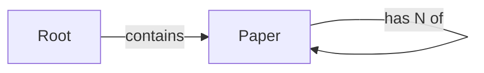

# Grad Student Paper Library

## Overview

The library is a single graph-persistent `Paper` node type stored on the
shared guest `root`. There are no edges: papers are flat records, so all
traversal is the untyped `[root -->]` outgoing walk. Data flows as: the
`save_paper` walker connects a freshly built node onto `root`; the read
walkers (`list_papers`, `search_papers_by_tag`) traverse `[root -->]` with a
`[?:Paper]` type filter (and, for search, an additional field predicate on
`tags`); `get_paper_details` is a function that finds one node by `jid`
without visiting.

## Data model

### node Paper
- has title: str
- has author: str
- has summary: str
- has tags: list[str] = [];
- has source_url: str
- has created_at: datetime [= None]
- has jid: jid (auto-generated by the runtime — do NOT declare)

Notes:
- No `id` field. Jac auto-generates the built-in `jid` identifier for every
  node; endpoints reference it via `jid(paper)`.
- `created_at` is a `datetime` (from `import from datetime { datetime }`),
  generated at save time by `save_paper` and assigned to the field. The node
  default is `None`.
- `tags` defaults to an empty `list[str]` so papers can be saved with no tags.

## Endpoints

### save_paper  —  walker:pub
- inputs: title: str, author: str, summary: str, tags: list[str], source_url: str
- output: report `{"jid": jid(paper), "title": ..., "author": ..., "summary": ..., "tags": ..., "source_url": ..., "created_at": ...}`
- flow:
    1. `created_at = datetime.now();` — generate the timestamp.
    2. `paper = Paper(title=self.title, author=self.author, summary=self.summary, tags=self.tags, source_url=self.source_url, created_at=created_at) as Paper;`
    3. `root ++> paper;` — connect the new node onto the shared guest root so it is reachable by later reads.
    4. `report {"jid": jid(paper), "title": paper.title, "author": paper.author, "summary": paper.summary, "tags": paper.tags, "source_url": paper.source_url, "created_at": paper.created_at};`
- touches: Paper (writes / connects)

### list_papers  —  walker:pub
- inputs: none
- output: report `{"papers": [root -->][?:Paper]}` (the list of Paper nodes)
- flow:
    1. `visit [-->];` — traverse outgoing edges from root.
    2. `gather with Paper entry { report here; }` — report every Paper node (the nodes themselves are the wire payload; the jac client rehydrates typed instances).
- touches: Paper (reads)

### search_papers_by_tag  —  walker:pub
- inputs: tag: str
- output: report `{"papers": [root -->][?:Paper, tag in tags]}` (filtered list of Paper nodes)
- flow:
    1. `visit [-->[?:Paper]];` — traverse outgoing edges from root.
    2. `gather with Paper entry { report self; }`
    3. filter to `[p for p in papers if tag in p.tags];` — keep only papers whose `tags` list contains the requested tag.
    4. `report {"papers": filtered};`
- touches: Paper (reads)

### get_paper_details  —  def:pub
- inputs: id: str  (a Jac `jid`)
- output: -> Paper | None
- flow:
    1. `matches = [root -->][?:Paper, jid(p) == id];` — read the outgoing graph and narrow with a combined type + field predicate (compare the node's `jid` to the requested id).
    2. `return matches[0] if matches else None;` — return the matching Paper, or `None` when not found (the REST layer turns `None` into a 404).
- touches: Paper (reads)

## Traversal notes

- All reads start from the untyped `[root -->]` outgoing walk; every read nests
  `[?:Paper]` to recover the node type (an untyped edge walk would otherwise
  yield `Unknown`-typed nodes and warn W1051 on field access).
- `search_papers_by_tag` uses a field predicate — `tag in p.tags` — inside the
  `[?:Paper]` filter. Jac comprehensions support the `in` membership operator on
  lists, so `if tag in p.tags` is the idiomatic membership test.
- `get_paper_details` deliberately uses no `visit`/`report`: it is a single-node
  lookup, so it is a `def:pub` function with a typed return (`Paper | None`),
  not a walker.
- Because there are no edges, no walker needs `visit` + multiple `gather`
  abilities: `list_papers` and `search_papers_by_tag` each use one `gather`
  ability scoped to `Paper`.
